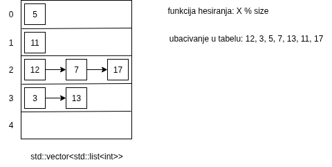
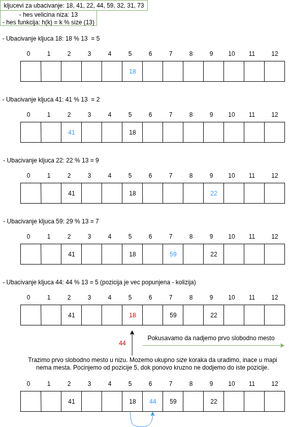
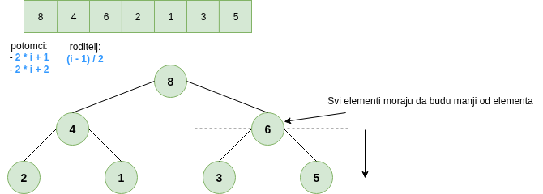

# Algoritmi

## Korektnost
 - minimum u nizu
 - zbir u nizu
 - trobojka
 - Hornerova sema
 - najmanji koji nije zbir (sortirano)
 - drugi na rang listi
 - dvobojka

## Slozenost
 - broj podstringova - binarni string
 - nedostajuci broj (sortitano)
 - deljiv u intervalu
 - najduza serija pobeda
 - rastuci segmenti (preko formule)

## Neke implementacije strukture podataka
 - Stek
 - Red
 - Hes tabele
   - resavanje kolizije: ulancavanje, linearno popunjavanje, dvostruko hesiranje
 - Max Hip struktura podataka 

Obzirom da moze da se desi da treba da dodamo element na istu poziciju koja je vec zauzeta.
Kod metode resavanja kolizije preko ulancavanja (povezane liste),
to se resava tako sto na tu poziciju u nizu imamo listu koja drzi sve elemente.

Metod ulancavanja:

Metod linearno popunjavanje:

Metod dvostrukog hesiranja: umesto linearnog trazenja sledeceg slobodnog mesta, koristimo drugu hes funkciju za pronalazenje slobodnog mesta.

Max-heap: struktura podataka gde odrzavamo maksimalan element. Osobina je da u podstablu ne sme da se nadje veci element nego sto je roditelj.
